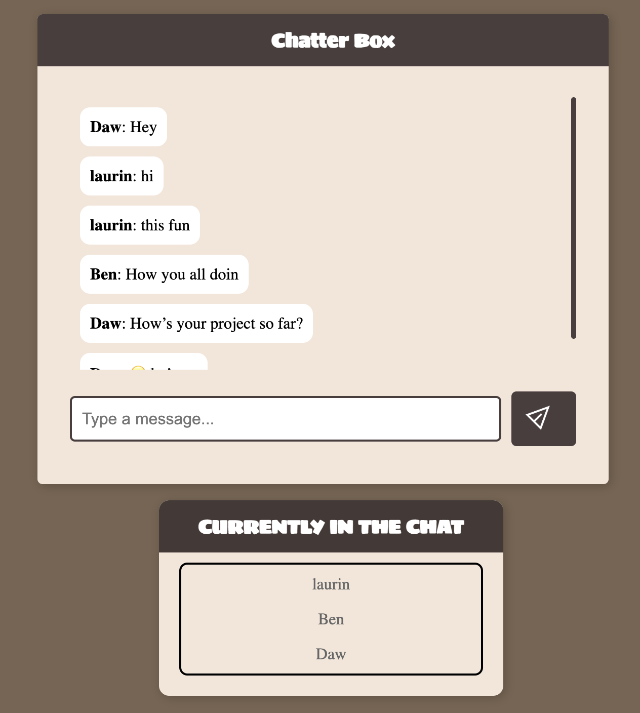

## Overview

**Project Title**: Chatter-box App

**Project Description**: A real-time chat application that allows users to communicate instantly using WebSockets. Each user sees their own messages aligned to the right, while received messages appear on the left, similar to WhatsApp. The app also notifies when users join or leave the chat.

**Project Goals**: Implement real-time communication using WebSockets.
Ensure proper message alignment (sent messages on the right, received messages on the left).
Show notifications for user connections and disconnections.
Maintain a responsive and user-friendly UI

## Instructions for Build and Use

Steps to build and/or run the software:

1. clone the repository: git clone https://github.com/LaulinVasquez/Chat-app.git
cd Chat-app
2. install dependencies: npm install
3. start the Websocket Server: node app.js
4. start the frontend server: node server.js
5. Go to the browser and past this link: https://chatter-box-app-c3ca2db54f7e.herokuapp.com/
6. Invite a friend or a family member to use the same link and chat!

Instructions for using the software:

1. Open the app in a browser.
2. Enter a username when prompted.
3. Type a message in the input box and press Send.
4. Your messages appear on the right, and messages from others appear on the left.
See notifications when users join or leave the chat

## Development Environment 

To recreate the development environment, you need the following software and/or libraries with the specified versions:

* Node.js (version v23.6.0)
* npm (version 11.0.0)
* Express (npm install express) – for serving the frontend
* WebSocket (ws package) (npm install ws) – for real-time chat
* Heroku to host the app 

## Useful Websites to Learn More

I found these websites useful in developing this software:

* [Website MDN Websockets Documentation](https://developer.mozilla.org/en-US/docs/Web/API/WebSocket)
* [NPM](https://www.npmjs.com/package/ws)
* [Videosdk](https://www.videosdk.live/developer-hub/websocket/npm-websocket)
* [Express](https://expressjs.com/en/guide/routing.html)
* [Heroku](https://devcenter.heroku.com/categories/reference#deployment)

## Future Work

The following items I plan to fix, improve, and/or add to this project in the future:

* [Add group chats]
* add a database to save conversation
* [Add typing indicators]
* [Improve security]